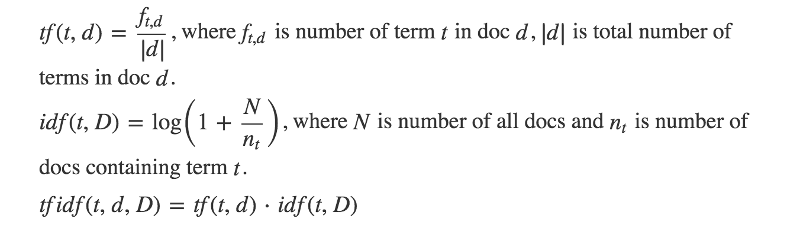

# PreporukaSadrzaja

##O projektu

Aplikacija predstavlja vid web preporuke baziran na upitu korisnika. Korisnik želi da pronađe odgovarajući blog, novinski članak ili slično, na osnovu zahteva koji predstavlja relativnu putanju do fajla koja sadrži tekst, odnosno u aplikaciji string. Primenom hill climbing algoritma, koji će detaljnije biti objašnjen u nastavku, generiše se random tekst iz baze (koja sadrži 120 tekstova), i poredi se sa zadatim upitom. Ono što je predmet poređenja jeste sličnost između tekstova koja se dobija u formi vektora korišćenjem takozvanog tf*idf računanja i računanja kosinusne sličnosti o kojima će takođe biti više reči u nastavku. Posle jedne ili više iteracija(što će najćešće biti slučaj) dobija se najverovatnije najsličniji tekst zadatom upitu. Ne i uvek, iz prostog razloga što hill climbing algoritam ne prolazi nužno kroz sve tekstove u bazi. 

##Način prikupljanja podataka i njihovo procesiranje

U ovoj aplikaciji biće korišćeni tekstualni fajlovi preuzeti sa sajta [*The Guardian*](https://www.theguardian.com). Tačnije korišćenjem RSS feed-a biće uzete vesti/članci u okviru rss dela sajta. Tekst koji se preuzima sa interneta, preuzima se uz pomoć [Jsoup biblioteke](https://jsoup.org/) i njenih klasa, odnosno metoda. Tako dobijeni tekstovi nisu optimalni za ulazak u algoritam i dalje računanje. Samim tim, potrebno je da se isti daju u čitljivijem obliku za hill climbing, odnosno tf*idf i kosinusnu sličnost. TagMe anotator, čija se primena može videti na sajtu [*TagMe*](https://tagme.d4science.org/tagme/) se koristi da prečisti tekstove, tj.da  prepozna koncepte i entitete o kojima se govori u tekstu i povezuje ih sa odgovarajućim Wikipedia konceptima. Glavni kriterijumi za uzimanje relevantnih reči se nazivaju “rho” i “epsilon”, tj.na osnovu njih, TagMe smanjuje/povećava skup reči koje će biti preuzete iz upita. Startovanjem anotatora dobija se json fajl, za svaki tekst koji smo dobili preko rss feeda. Iz takvih json fajlova, stvaramo konačne tekstualne fajlove koji će sadržati samo dobijene reči iz TagMe-a, malim slovima, bez karaktera koji nisu slovo ili broj. Takvi tekstovi biće ulazi u aplikaciju, tj.algoritam. Ali ne kao stringovi, već kao vektor brojeva. 

##Kako od stringa napraviti vektor brojeva?

Na najjednostavnijem primeru dve rečenice koje glase:
```
1) Julie loves me more than Linda loves me 
2) Jane likes me more than Julie loves me
```
treba napraviti niz, tj.vektor brojeva. Prvo što treba da se uradi jeste - da se izvade sve reči koji se nalaze u ova dve rečenice, bez da se dva puta ponovi neka reč(za slučaj da se neka ponavlja). me Julie loves Linda than more likes Jane – je dakle naša rečenica preko koje će se praviti vektori. Kako? Obe rečenice će biti predstavljene preko vektora iste dužine, dužine rečenice koja predstavlja njihovu uniju, u ovom slučaju 8. Brojevi koji će popunjavati ove nizove jesu upravo broj ponavljanja svake pojedinačne reči za prvi, odnosno drugi tekst. Reč “me” se ponavlja u prvom tekstu 2 puta, isto toliko i u drugom. Reč “Jane” se ne pojavljuje u prvom tekstu, dok se u drugom pojavljuje jedanput. Nizovi za sada izgledaju ovako [2,0 odnosno [2,1…Ponavljajući proces do kraja dobili smo vektore koji su nam neophodni u daljem radu i koji će služiti za nastavak rada u kome će se koristiti tf-idf i cosine similarity.

##TF-IDF

TF-IDF, odnosno term frequency–inverse document frequency predstavlja spefičnu metodu koja ima za cilj da odredi koliko je neka reč bitna u dokumentu, tačnije u kolekciji dokumenata. Ima više konkretnih matematičkih formulacija, gde logika međutim ostaje ista. Kod ovog primera konkretno tf se izračunavao kao količnik (broj ponavljanja konkretne reči/ukupan broj reči u dokumentu). Idf se računao kao log(1+(broj dokumenata/broj dokumenata koji sadrže tu reč)). Postoji više reči, postoji više rečenica, pa će rezultat ovih izračunavanja predstavljati matricu, kao konačan ulaz u računanje kosinusne sličnosti.



##CosineSimilarity

Kosinusna sličnost meri kosinus ugla između dva vektora. Predstavlja jedan od poznatijih pristupa prilikom poređenja sličnosti između dva teksta. Kosinusna sličnost između – d1 i d2 - dva vektora je: cos( d1, d2) = (d1• d2) / ||d1|| ||d2|| gde • označava skalarni proizvod vektora, i || d || označava dužinu vektora d. Što su dve instance sličnije, rezultat je bliži 1, što se više razlikuju rezultat je bliži 0.

Npr. 

```
------------------------------------------
Begin Calculations - Formatted For Easy Copy & Paste Into your Document
------------------------------------------


Let d1 = 10 5 3 0 0 0 0 0 0
Let d2 = 5 0 7 0 0 9 0 0

Cosine Similarity (d1, d2) = dot(d1, d2) / ||d1|| ||d2||

dot(d1, d2) = (10)*(5) + (5)*(0) + (3)*(7) + (0)*(0) + (0)*(0) + (0)*(9) + (0)*(0) + (0)*(0) + (0)*() = 71

||d1|| = sqrt((10)^2 + (5)^2 + (3)^2 + (0)^2 + (0)^2 + (0)^2 + (0)^2 + (0)^2 + (0)^2) = 11.5758369028

||d2|| = sqrt((5)^2 + (0)^2 + (7)^2 + (0)^2 + (0)^2 + (9)^2 + (0)^2 + (0)^2) = 12.449899598

Cosine Similarity (d1, d2) = 71 / (11.5758369028) * (12.449899598)
                           = 71 / 144.118007202
                           = 0.492651830109


------------------------------------------
End Calculations
------------------------------------------
```

Takvi rezultati se čuvaju u json fajlu u formatu keyPrvog : “[putanjaFajla]”, keyDrugog : “[putanjaFajla]”, sličnost : [double vrednost]. Kada su se izračunale sve sličnosti između svih dokumenata, dobija se tek mogućnost primene Hill Climbing algoritma.

   

##Rad algoritma – HillClimbing

U računarskoj nauci, Hill Climbing, to jest pretraživanje usponom je matematička optimizaciona tehnika koja pripada familiji lokalne pretrage. Ovo je iterativan algoritam koji počinje sa proizvoljnim rešenjem za problem. Trenutno proizvoljno rešenje biće i konačno ukoliko je ono u okviru definisanog problema bolje od svojih suseda.(Susedi u algoritmu mogu biti brojevi koji su najbliži trenutno posmatranom) Ukoliko se pojavi sused koji nudi bolje rešenje za dati problem, ono postaje centar algoritma i dalji postupak se sprovodi sve dok se posle određenog broja iteracija ne nađe bolje rešenje. Dakle ako promena suseda ne dovede do boljeg rešenja posle određenog vremena, pronađeno je krajnje rešenje. Bolje rešenje se traži pretragom suseda elementa. Ono što može biti problem pri ovom pristupu, jeste problem lokalnog minimuma. 

[PRIMER](https://en.wikipedia.org/wiki/Hill_climbing#/media/File:Hill_Climbing_with_Simulated_Annealing.gif)

Pre pokretanja samog algoritma, u aplikaciji su izračunate sličnosti između svih dokumenata. Sam rad algoritma u aplikaciji preuzima json objekat sa atributima koji izgledaju u sledećem formatu (fajl - slicnostiProba.json) 
```
{	
	"keyPrvog":"fajloviProba/osmi.txt",
	"keyDrugog":"probniUpiti/drugiUpit.txt",
	"slicnost":0.05406268847587203
}
```
Inicijalno se definiše random početna vrednost, tj.proizvoljno odabran početni tekst i onda se računa sličnost između upita i tog teksta. Inicijalna maksimalna sličnost je upravo između upita i random početnog teksta. Svaki od tekstova uključujući i random tekst imaju svoju listu najsličnijih tekstova, poređanih po opadajućem kriterijumu za sličnost. Prvo što poredimo jeste sličnost između (upita i random teksta) i sličnost(upita sa prvim susedom random teksta, odnosno njemu najsličnijeg). Ukoliko je drugi broj veći on sada ima maksimalnu vrednost. Rekurzivno se dalje odvija cela procedura, i staje onda kada se pri određenom broju puta za redom ne može naći veća sličnost između trenutnog maksimuma i njegovih suseda. Dobija se kao rezultat tekst, putanja do fajla koja sadrži prečišćen članak. Istom se može pristupiti jednostavnom pretragom preko interneta samo kucajući naziv fajla, bez txt ekstenzije.
Aplikacija sadrži dva dela, jedan koji radi na osnovu lakšeg primera za razumevanje(8 fajlova, 8 upita) i kompleksnijeg(120 fajlova, 8 upita). Za lakši(probni) deo broj iteracija ide sve do 6(Ne može se pojaviti kao rezultat fajl koji nije najsličniji, ali to je iz razloga da se ovde vidi sam ispis i samo poređenje). Za kompleksniji, ispis nije toliko detaljan, i ne može se u potpunosti ispratiti, ali prikazuje rad hill climbing-a na nekom realnom primeru sa većim brojem tekstova. Kod njega već postoji mogućnost da se ne pojavi generalno najsličniji fajl, jer je broj iteracija sveden na znatno manji broj u odnosu na broj tekstova - 20. 

##Pokretanje aplikacije/algoritma

U programu se radi sa relativnim putanjama, tako da ne bi trebalo da bude problema pri radu sa različitim operativnim sistemima. Nije neophodno preći preko svih koraka(ponovno preuzimanje vesti i sl.), već je dovoljno samo realizovati korak pod nazivom Pokretanje algoritma.

Celokupan proces rada izgleda ovako u koracima : 
*  Pokretanje Jsoup main metode - > dobijanje teksta preuzetih guardian vesti u JSoupRSS folderu
*	Pokretanje StartAnnotators main metode - > preuzimanje fajlova iz JSoupRSS foldera i stvaranje json fajlova posredstvom TagMe anotatora
*	Pokretanje main metode klase JSONPamcenje, koja pokreće generisiFajloveMetodu, koja za svaki fajl iz fajloviJSON foldera stvara novi .txt fajl u folderu konacniFajlovi. Ti txt fajlovi biće konačni ulazi, tj. Stringovi konvertovani u vektore integera, spremni za računanje tf*idf i kosinusne sličnosti. 
*	Čuvanje sličnosti između svih potencijalnih upita i fajlova(Postoji konačan broj upita) - > pokretanjem metode main metode tfPojasnjenje, koja pokrece metodu vratiSlicnosti. Fajlovi su – slicnostProba.json(jednostavniji primer), odnosno slicnosti.json(kompleksniji primer)
*	Pokretanje algoritma : src/Program.java (lakši primer), src/ProgramWebPreporuka(kompleksniji primer)

Potrebno je ukucati naziv fajla iz upita, ima ih 8 i za kompleksniji i za jednostavniji primer u folderima za upite(relativna putanja - probniUpiti/upiti) npr. sedmiUpit.txt. Rezultat će dati relativnu putanju do .txt fajla koji će imati naziv u formatu kao vest na guardian sajtu. 

##Literatura

1.  [http://myencyclopedia.top/blog/2015/10/tf-idf/](http://myencyclopedia.top/blog/2015/10/tf-idf/)
2.  [http://blog.christianperone.com/2013/09/machine-learning-cosine-similarity-for-vector-space-models-part-iii/](http://blog.christianperone.com/2013/09/machine-learning-cosine-similarity-for-vector-space-models-part-iii/)  
3.  [https://en.wikipedia.org/wiki/Hill_climbing](https://en.wikipedia.org/wiki/Hill_climbing)

